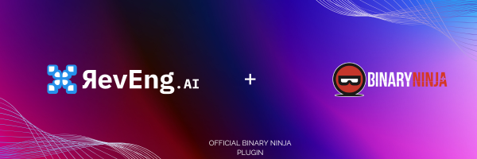
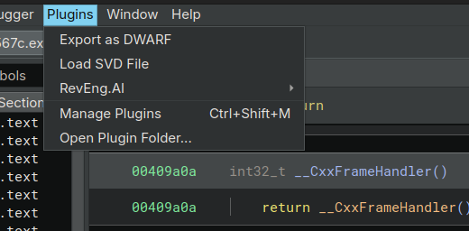
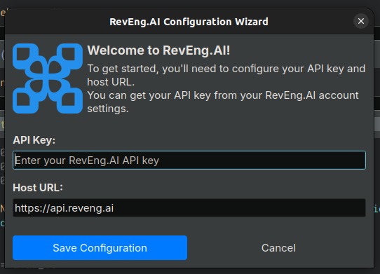
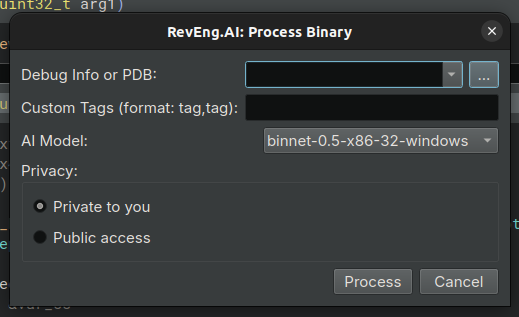
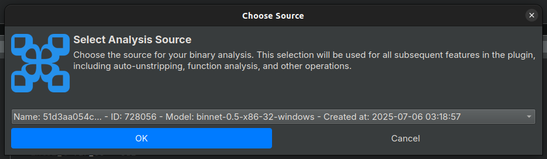
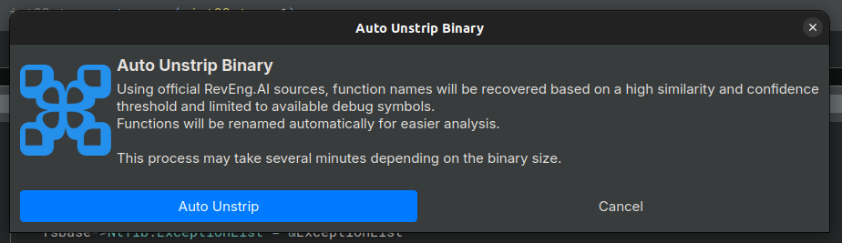
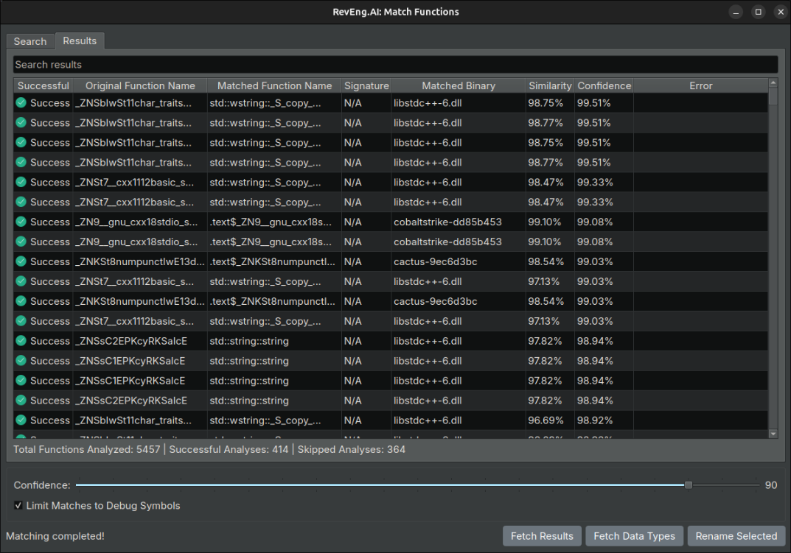

<p align="center"></p>
Official Binary Ninja Plugin for RevEng.AI

### Features Supported

This plugin brings the power of RevEng.AI directly into Binary Ninja. Here are the main features currently supported:

- **Configuration Panel**: Easily configure your API credentials and platform settings.
- **Choose a Source**: Select the uploaded binary whose analysis will be used for other features such as matching and renaming.
- **Process Binary**: Upload the currently loaded binary in Binary Ninja to RevEng.AI for analysis.
- **Auto-Unstrip**: Automatically restore stripped symbols in your binary using our AI engine.
- **Function Matching**: Compare and match functions from your current binary with those in your existing collections.

---

## Installation & Running 🚀

### Step 1: Locate Binary Ninja Plugins Folder

Locate your Binary Ninja user plugin directory:

- **Tools > Plugins > Open Plugin Folder** from the Binary Ninja menu

> 💡 **Tip**: This opens the correct path regardless of OS or install type.

Expected output locations:
 - Linux: `~/.binaryninja/plugins/`
 - Windows: `%APPDATA%\Binary Ninja\plugins\`
 - macOS: `~/Library/Application Support/Binary Ninja/plugins/`


### Step 2: Download & Install the Plugin

1. Visit the releases page: https://github.com/RevEngAI/reai-ida/releases
2. Download the latest release (look for the most recent version).
3. Extract the contents into the opened plugin folder.
4. Ensure the folder structure looks like this:

```
Example in Linux...
~/.binaryninja/plugins/
   └── revengai/
      └── [plugin files...]
```

> 🖼️ *Insert screenshot of the correct plugin folder structure*

### Step 3: Install Dependencies

In your system terminal (not inside Binary Ninja), move to the directory with the 'requirements.txt' file and install required dependencies using:

```bash
pip install -r requirements.txt
```

Or directly from within Binary Ninja’s built-in Python terminal:

```python
import subprocess
subprocess.check_call(['pip', 'install', '-r', '/path/to/requirements.txt']) # Change to your path to requirements.txt
```

---

## Using the Plugin ⚙️

Once installed, you’ll find `RevEng.AI` listed in the Binary Ninja plugins toolbar menu.



Make sure to restart Binary Ninja completely after installation.
Then, check the Plugins menu — the RevEng.AI plugin should be visible.
Finally, load a binary and explore the features described below.

### 1. Configure the Plugin

Select `Configuration` from the menu to set up your API key and host.



Clicking "Continue" will validate your API key.

---

### 2. Process a Binary

Upload the currently loaded binary to RevEng.AI:

- Select `RevEng.AI > Process Binary`



Before starting the process, you can add a PDB file and debug information, assign custom tags for better tracking, choose which AI model you want to use, and decide whether to keep the analysis private (default) or make it publicly available.
The plugin will handle the upload and initiate the analysis. Once completed, an internal analysis ID is assigned.

---

### 3. Choose Source Analysis

If you have already processed your binary on the platform or if there are publicly available analyses, you can select one as your working source.

- Select `RevEng.AI > Choose Source`



This is required before using some features like function matching or auto unstrip.

---

### 4. Auto Unstrip

Bring back symbol names automatically:

- Select `RevEng.AI > Auto Unstrip`



Functions will be renamed with the most likely matching names from your configured collections.

---

### 5. Match Functions

Use function matching to identify similar functions in other binaries or collections:

- Click `RevEng.AI > Match Functions`



Matched functions are displayed based on the given confidence value. You can navigate or rename based on the results.

---

## Troubleshooting

- Only Binary Ninja 3.0+ is supported
- Python 3.9 or later is required
- Ensure your API key is valid and your analysis contains function-level information

## Software Requirements

This plugin relies on:

- [reait](https://github.com/RevEngAI/reait)
- requests
- PySide6

## License

This plugin is released under the GPL-2.0 license. 

## Disclaimer

Binary Ninja is a trademark of Vector 35. This project is not affiliated with or endorsed by Vector 35.
