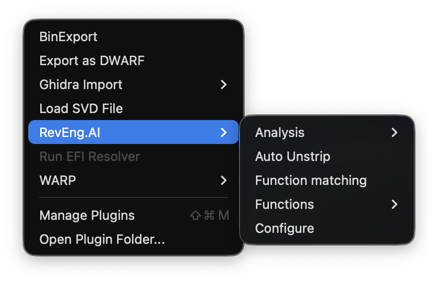
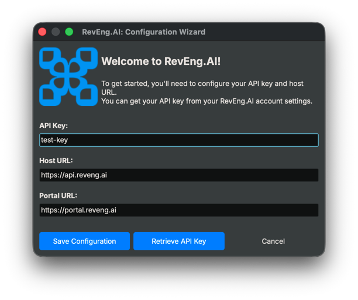
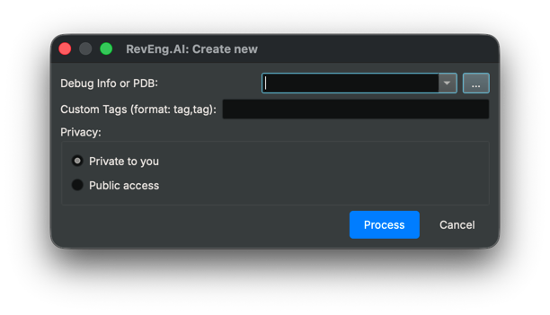
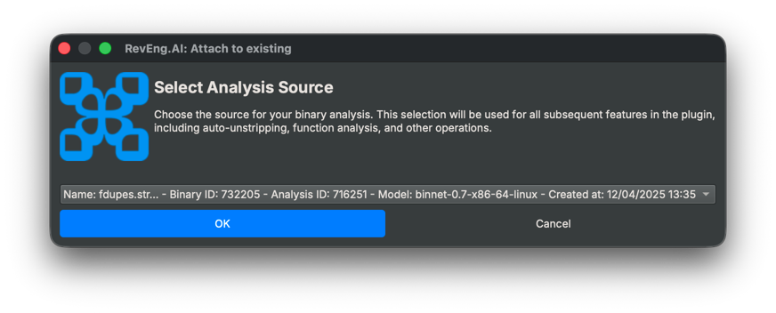
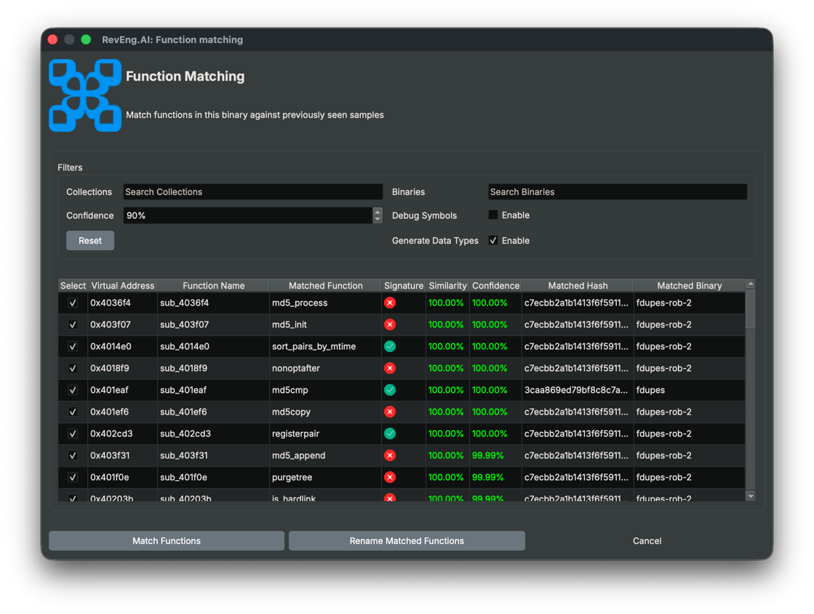
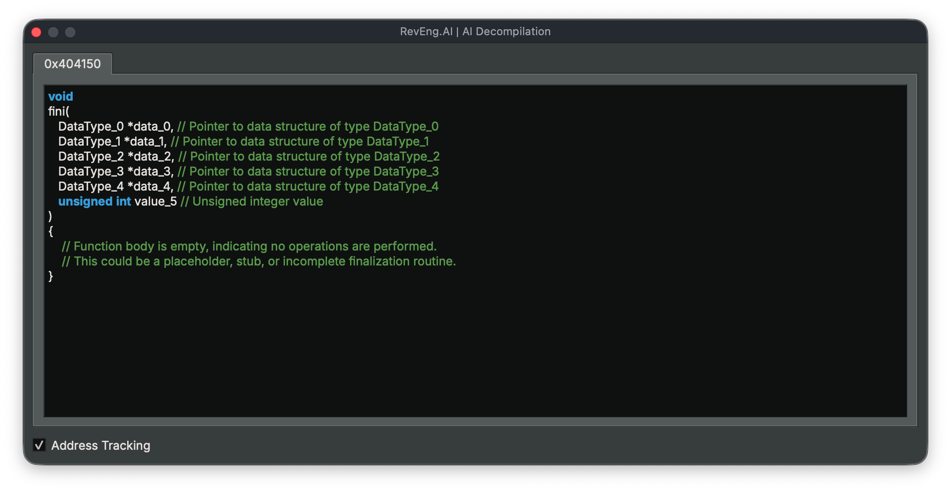

# RevEng.AI Binary Ninja Plugin

[Discord](https://discord.com/invite/ZwQTvzfSbA)

### AI Assisted Binary Analysis

Released as open source by RevEng.ai - https://reveng.ai

## Description

The RevEng.AI Binary Ninja plugins allows you to interact with our API from within Binary Ninja.
This allows you to upload your currently open binary for analysis,
and use it for Binary Code Similarity to help you Reverse Engineer stripped binaries.

## Table of contents

- [Key Features](#key-features)
- [Installation](#installation)
  - [Setup](#setup)
  - [Verifying the Installation](#verifying-the-installation)
- [Usage](#usage)
    - [Configuration](#configuration)
    - [Analysis](#analysis)
    - [Auto Unstrip](#auto-unstrip)
    - [Function Matching](#function-matching)
    - [AI Decompilation](#ai-decompilation)
- [Contributing](#contributing)
  - [Reporting Bugs](#reporting-bugs)
- [Known Issues](#known-issues)

### Key features

This plugin brings the power of RevEng.AI directly into Binary Ninja. Here are the main features currently supported:

- **Configuration Panel**: Easily configure your API credentials and platform settings.
- **Choose a Source**: Select the uploaded binary whose analysis will be used for other features such as matching and renaming.
- **Process Binary**: Upload the currently loaded binary in Binary Ninja to RevEng.AI for analysis.
- **Auto-Unstrip**: Automatically restore stripped symbols in your binary using our AI engine.
- **Match Functions**: Compare and match functions from your current binary with those in your existing collections.
- **Match Unique Function**: Compare and match a single function from your current binary with those in your existing collections.
- **View Function in Portal**: Convenient shortcuts to explore the function within the platform interface.


## Installation

The builds for latest stable version of the RevEng.AI Binary Ninja plugin can be downloaded from the [Releases](https://github.com/revengai/plugin-binary-ninja/releases/latest) page.

### Supported Binary Ninja versions

We support Binary Ninja 3.0+ on Windows, macOS and Linux with Python version `3.10`.

### Setup

1. **Download** the plugin code for your platform from the [Releases](https://github.com/revengai/plugin-binary-ninja/releases/latest) page.
2. **Extract** the archive contents into your Binary Ninja plugins directory.

Locate your Binary Ninja user plugin directory:

- **Tools > Plugins > Open Plugin Folder** from the Binary Ninja menu

> 💡 **Tip**: This opens the correct path regardless of OS or install type.

Expected output locations:
 - Linux: `~/.binaryninja/plugins/`
 - Windows: `%APPDATA%\Binary Ninja\plugins\`
 - macOS: `~/Library/Application Support/Binary Ninja/plugins/`


After extraction, the directory structure should look like this:
```
Example for Linux...
~/.binaryninja/plugins/
   └── reai_toolkit/
      └── [plugin files...]
```

3. **Restart** Binary Ninja if it was running.

### Verifying the Installation
Once Binary Ninja is open, confirm that the RevEng.AI menu appears in the plugins menu bar.
If no errors are displayed in the console and the menu loads, your installation is complete.

[]()

## Usage

In this section, we provide an example workflow for our plugin.

### Configuration

The first thing we need to do is configure the plugin with our API key and the host to use.

When you load the plugin for the first time, or by selecting `RevEng.AI -> Configure`, you will be guided through the configuration process.

[]()

Enter your API Key from the [RevEng.AI Portal](https://portal.reveng.ai/settings) into the API Key field
where it will be validated and saved for future use.

### Analysis

Once configured, you can upload the current binary for analysis by selecting `RevEng.AI -> Analysis -> Create New`.
It's usually enough to keep the default options, but you can adjust the analysis settings as needed.



If you have already processed your binary on the platform or if there are publicly available analyses, you can select 
one as your working source without needing to upload again.

- Select `RevEng.AI -> Analysis -> Attach to existing`



This is required before using features like function matching or auto unstrip.

### Auto Unstrip

The `Auto Unstrip` tool allows you to automatically recover function names based on our debug symbol database. It is
an automated process that will recover all function names from the currently attached binary.

You can access it by selecting `RevEng.AI -> Auto Unstrip` from the menu.

### Function Matching

The function matching tool allows you to rename functions in a binary based on similarity to functions in our database.
It is a manual process that can be done on a per-function basis, or in batch mode for the entire binary. It allows you
to have more control over which functions are renamed, and when as well as the ability to review the suggested names before
applying them.

To match with all functions in the binary, select `RevEng.AI -> Function Matching`.


Or to match a single function, select the function and then navigate to `RevEng.AI -> Functions -> Match Function`.

Adjust the filters as necessary and when ready click `Match Functions`.
For multiple functions at most 1 result will be returned. For individual functions, up to 10 functions will be returned.
You can then decide to rename a function to one of the suggested names by clicking `Rename Matched Functions`.

### AI Decompilation

The `AI Decompilation` tool allows you to get AI generated decompilation of selected functions. You can access it by
selecting a function in Binary Ninja's listing or decompiler view and selecting `RevEng.AI -> Functions -> AI Decompilation`.



The window will show you the AI generated decompilation of the selected function as well as a
natural language explanation of what the function does.

The window can be pinned and will update as you select different functions.

## Contributing

We welcome pull requests from the community.

The plugin is still undergoing active development currently, and we are looking for feedback on how to improve it.

### Reporting Bugs

If you've found a bug in the plugin, please open an issue via [GitHub](https://github.com/RevEngAi/plugin-binary-ninja/issues/new/choose), or create a post on our [Discord](https://discord.com/invite/ZwQTvzfSbA).

## Known Issues

- On macOS, you might need to remove the quarantine attribute from the plugin folder to allow Binary Ninja to load it properly.

After installation, run the following command:

```bash
xattr -dr com.apple.quarantine "$HOME/Library/Application Support/Binary Ninja/plugins/reai_toolkit"
```

It removes the macOS “quarantine” flag (added to files downloaded from the internet), so the system won’t block or warn when loading the plugin.

---